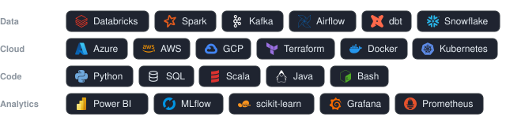

# Vignesh Perumal

Senior Data Engineer at Arc'teryx, in Vancouver. I make sure the data actually gets where it needs to go, and that people trust it when it arrives. Since 2016, across retail, fintech, and supply chain.

- **Now:** B2B sales analytics on Databricks, plus enterprise data quality standards on ODCS and DQX
- **Lately:** agentic workflows, vector search, LLM-backed systems
- **Before:** AWS, Best Buy Canada, Procogia, Wells Fargo
- **School:** MSc Professional Computer Science (Big Data), Simon Fraser University

### What I work with

Those badges aren't shields.io. [`build-stack.py`](build-stack.py) inlines the logos and renders [`stack.svg`](stack.svg), so they're served from this repo and can't be rate-limited or taken down.

### Work I'm proud of

- A metadata-driven ELT framework pulling SAP BW and S/4 HANA into Azure Data Lake, ingesting 300+ tables on a daily refresh.
- Streaming ingestion for AWS Q chat with PII redaction, feeding 60+ dashboards for 400+ stakeholders.
- An LLM product assistant on MLflow for in-store associates, cutting product attribute lookup times by 70%.
- A Databricks platform on instance pools, tags for governance and SQL Alerts for monitoring. Cloud spend dropped 6x.

### Repos worth a look

| Project | What it is |
| --- | --- |
| [databricks-axi](https://github.com/p33ves/databricks-axi) | Databricks CLI built for AI agents. Compact TOON output, lean schemas, errors that say what to try next. |
| [msssql-auto-dba](https://github.com/p33ves/msssql-auto-dba) | PowerShell automation for SQL Server patching and the DBA work around it. |
| [azure-code-review](https://github.com/p33ves/azure-code-review) | Code review tooling for Azure. |
| [SecretHitler-Bot](https://github.com/p33ves/SecretHitler-Bot) | Discord bot that moderates a game of Secret Hitler for your friends. |

### Elsewhere

[Portfolio](https://p33ves.github.io/) · [LinkedIn](https://www.linkedin.com/in/perumal-vignesh/) · [Email](mailto:itsvigneshperumal@gmail.com)

<picture>
  <source media="(prefers-color-scheme: dark)" srcset="https://raw.githubusercontent.com/p33ves/p33ves/output/snake-dark.svg">
  <source media="(prefers-color-scheme: light)" srcset="https://raw.githubusercontent.com/p33ves/p33ves/output/snake.svg">
  
</picture>

